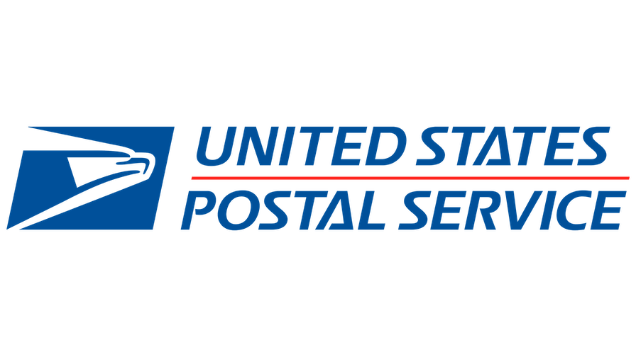

<p align="center">
  
</p>

[](https://twitter.com/JackieQi)
[](https://www.linkedin.com/in/chiqi/)
# USPS Passport appointment finder


Little python script to help check available passport appointment for 30 days given specified location and start date.

<p align="center">
  
</p>

- [Helpful links](#helpful-links)
- [Features](#features)
- [Requirements](#requirements)
- [Usage](#usage)
- [API reference](#api-reference)
- [Contributing](#contributing)
- [Backstory](#backstory)


## Helpful links
[Appointment entrance](https://tools.usps.com/rcas.htm)

[Processing time](https://travel.state.gov/content/travel/en/passports/how-apply/processing-times.html)

## Features
- [x] search by zip and date
- [x] search for next one month continuously

## Requirements

You need to install [pyhon3](ttps://www.python.org/downloads/) and its dependencies (pip, venv)

```python3 -m pip install requests```


## Usage
```$ python3 FILE_NAME```

## API reference
**GET** facility details (id)
```
curl --location 'https://tools.usps.com/UspsToolsRestServices/rest/v2/facilityScheduleSearch' \
--header 'Accept: application/json, text/javascript, */*; q=0.01' \
--header 'Content-Type: application/json;charset=UTF-8' \
--header 'x-requested-with: XMLHttpRequest' \
--header 'sec-ch-ua-mobile: ?0' \
--header 'user-agent: Mozilla/5.0 (Macintosh; Intel Mac OS X 10_15_7) AppleWebKit/537.36 (KHTML, like Gecko) Chrome/111.0.0.0 Safari/537.36' \
--data '{
    "city": "",
    "date": "20230503",
    "zip5": "94404",
    "numberOfAdults": "1",
    "numberOfMinors": "0",
    "poScheduleType": "PASSPORT",
    "radius": "20",
    "state": ""
}'
```
**GET** appointments for specific facility and date
```
curl --location 'https://tools.usps.com/UspsToolsRestServices/rest/v2/appointmentTimeSearch' \
--header 'Accept: application/json, text/javascript, */*; q=0.01' \
--header 'Content-Type: application/json;charset=UTF-8' \
--header 'x-requested-with: XMLHttpRequest' \
--header 'sec-ch-ua-mobile: ?0' \
--header 'user-agent: Mozilla/5.0 (Macintosh; Intel Mac OS X 10_15_7) AppleWebKit/537.36 (KHTML, like Gecko) Chrome/111.0.0.0 Safari/537.36' \
--data '{
    "date":"20230523",
    "productType":"PASSPORT",
    "numberOfAdults":"1",
    "numberOfMinors":"0",
    "excludedConfirmationNumber":[""],
    "fdbId":["1380637"],
    "skipEndOfDayRecord":true
}'
```

**GET** which date has open slot for appointment (*not used in the script*)
```
curl --location 'https://tools.usps.com/UspsToolsRestServices/rest/v2/appointmentDateSearch' \
--header 'Accept: application/json, text/javascript, */*; q=0.01' \
--header 'Content-Type: application/json;charset=UTF-8' \
--header 'x-requested-with: XMLHttpRequest' \
--header 'sec-ch-ua-mobile: ?0' \
--header 'user-agent: Mozilla/5.0 (Macintosh; Intel Mac OS X 10_15_7) AppleWebKit/537.36 (KHTML, like Gecko) Chrome/111.0.0.0 Safari/537.36' \
--data '{
    "numberOfAdults":"1",
    "numberOfMinors":"0",
    "fdbId":"1380637",
    "productType":"PASSPORT"
}'
```

## Todo
- [ ] move hard coded info out of main class
- [ ] load appointments with multi thread
- [ ] book appointment with earliest date, time, location
- [ ] add web frontend

## Contributing

Before contributing, please read the instructions detailed here [contribution guide](https://github.com/JackieQi/USPSPassportAppointmentFinder/blob/main/CONTRIBUTING.md).

## Backstory

USPS website is so hard to use when searching for appointments. I have an international trip coming which requires visa after naturalization.
It's pretty urgent for me to get the passport. Now here is the script to help whoever has the need.
